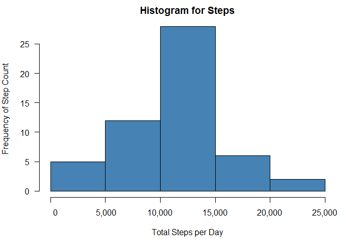
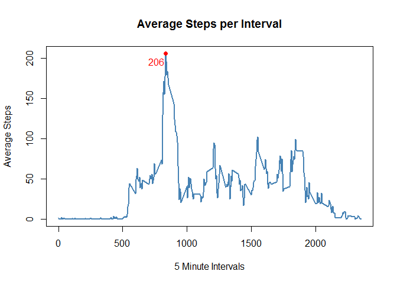
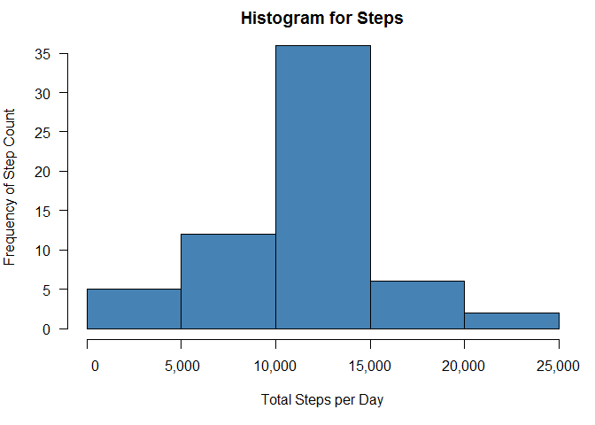
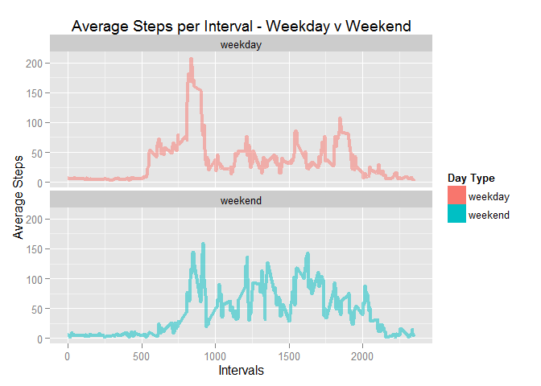

# Reproducible Research: Peer Assessment 1


## Loading and preprocessing the data
###Load the data and transform to suit needs

```r
#Assumes download of the zip file from course assignment to working directory
#Store the path to the wd data folder
files <- file.path(getwd(),"data/")

#store the zip file name for use in unzip
filezip <- list.files("./data", pattern = "zip")

#unzip the zip file and store the results in the data folder
unzip(file.path(files, filezip), exdir = "./data")

#assign the file name of the new data to a variable
filecsv <- list.files(files, pattern = "csv")

#read the data into R
data <- read.csv(file.path(files, filecsv))
data$date <- as.Date(data$date, format = "%Y-%m-%d")
```


## What is mean total number of steps taken per day?
###Create the histogram for total steps per day

```r
#Summarize the steps for each day by the sum of steps per day
dataSum <- aggregate(steps ~ date, data, sum, na.rm = TRUE)

#Set the global parameter options for the plot output
par(mfrow = c(1, 1), mar = c(5, 4, 2, 1), las = 1)

#Draw the histogram and add axes back
hist(dataSum$steps,
     main = "Histogram for Steps",
     xlab = "Total Steps per Day",
     ylab = "Frequency of Step Count",
     axes = F,
     col = "steelblue")
axis(side = 1, at = axTicks(1), labels = format(axTicks(1), big.mark = ","))
axis(side = 2, at = axTicks(2), labels = format(axTicks(2), big.mark = ","))
```

 

###Calculate the mean and median of the total steps per day

```r
stepMean <- round(mean(dataSum$steps, na.rm = TRUE), 2)
stepMedian <- round(median(dataSum$steps, na.rm = TRUE), 2)
```
The mean of the total steps per day is 1.076619\times 10^{4}.  
The median of the total steps per day is 1.0765\times 10^{4}.


## What is the average daily activity pattern?
###Create line chart for average steps per interval

```r
#Summarize the steps per interval by the average of steps per interval
dataInv <- aggregate(steps ~ interval, data, mean, na.rm = TRUE)
#Store the max steps per day to label the abline
aby <- round(max(dataInv$steps), 0)
#Store the max interval on the max step day
abx <- round(dataInv$interval[which.max(dataInv$steps)])

#Draw the graph and label appropriately
with(dataInv, plot(interval, steps, type = "l",
                   xlab = "5 Minute Intervals",
                   ylab = "Average Steps",
                   main = "Average Steps per Interval",
                   col = "steelblue",
                   lwd = 2))
points(abx, aby,  pch = 19, col = "red")
text(abx - 70, aby - 10, aby, col = "red")
```

 

The 5-Minute interval with the maximum number of steps is: Interval 835.


## Imputing missing values
##Imputing missing values

```r
#Store the count of missing values 
dataNA <- nrow(subset(data, is.na(data$steps) | is.na(data$date) | is.na(data$interval)))
```
The total number of rows in the data with missing values is: 2304.

###Replacing the NAs in a copy of the data set

```r
#Copy original data for na replacement
dataAll <- data
#Summarize original data by average steps per day
dataMean <- aggregate(steps ~ date, data, mean, na.rm = TRUE)

#add average steps to each day to merge
dataAll$steps <- ifelse(is.na(dataAll$steps), dataMean$steps, dataAll$steps)

#aggregate the new data by steps per day for histogram
dataSum1 <- aggregate(steps ~ date, dataAll, sum, na.rm = TRUE)
```

###Make a histogram of the total number of steps taken each day 

```r
#Set the global parameter options for the plot output
par(mfrow = c(1, 1), mar = c(5, 4, 2, 1), las = 1)

hist(dataSum1$steps,
     main = "Histogram for Steps",
     xlab = "Total Steps per Day",
     ylab = "Frequency of Step Count",
     axes = F,
     col = "steelblue")
axis(side = 1, at = axTicks(1), labels = format(axTicks(1), big.mark = ","))
axis(side = 2, at = axTicks(2), labels = format(axTicks(2), big.mark = ","))
```

 

###Calculate the mean and median of the total steps per day for the adjusted data

```r
stepMean1 <- round(mean(dataSum1$steps), 2)
stepMedian1 <- round(median(dataSum1$steps), 2)
```
The mean of the total steps per day is 1.076817\times 10^{4}.  
The median of the total steps per dat is 1.078918\times 10^{4}.

By replacing the NAs, the mean changed from 1.076619\times 10^{4} to 1.076817\times 10^{4}.  
By replacing the NAs, the median changed from 1.0765\times 10^{4} to 1.078918\times 10^{4}.


## Are there differences in activity patterns between weekdays and weekends?
###Create new factor variable based on weekend/weekday levels

```r
##Bring in the weekday values
dataAll$day <- weekdays(dataAll$date, abbreviate = FALSE)
##Classify each day as weekend or weekday
dataAll$dayCat <- ifelse(dataAll$day == "Sunday", "weekend", 
                                         ifelse(dataAll$day == "Saturday", 
                                                "weekend", "weekday"))
##use the dayCat to create a two level factor on weekend/weekday
dataAll$dayCat <- as.factor(dataAll$dayCat)
```

The new variable is called dayCat, which is of the type, factor,
and has levels: weekday, weekend.

###Create a panel plot of average steps per interval faceted by dayCat factor

```r
##Aggregate the average steps by interval and day category
dataAllMean <- aggregate(steps ~ interval + dayCat, dataAll, mean, na.rm = TRUE)
##Specifically call out the ggplot2 library
library(ggplot2)
#Assign the basic ggplot to g - average steps per interval
g <<- ggplot(dataAllMean, aes(interval, steps))
#plot the ggplot and add a line and facet the data by dayCat
g + 
        geom_line(aes(color = dayCat), size = 1.5, alpha = 0.5) + 
        facet_wrap(~dayCat, nrow = 2, ncol = 1) +
        labs(title = "Average Steps per Interval - Weekday v Weekend") +
        labs(x = "Intervals", y = "Average Steps") +
        geom_tile(aes(fill = dayCat)) +
        guides(fill = guide_legend(title = "Day Type", title.position = "top")) +
        guides(colour=FALSE)
```

 
  
  The weekday values tend to show a spike in the early intervals, ~800 to 900,  
which is quite a bit higher than the remainder of the intervals. The weekend has  
a similar spike, but it is not uniquely high when compared to the other intervals.
